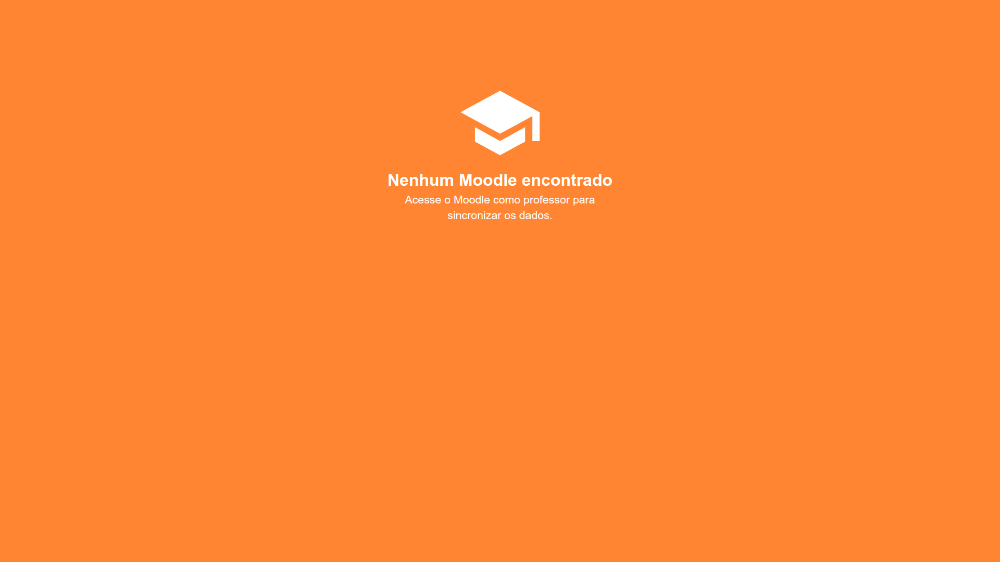
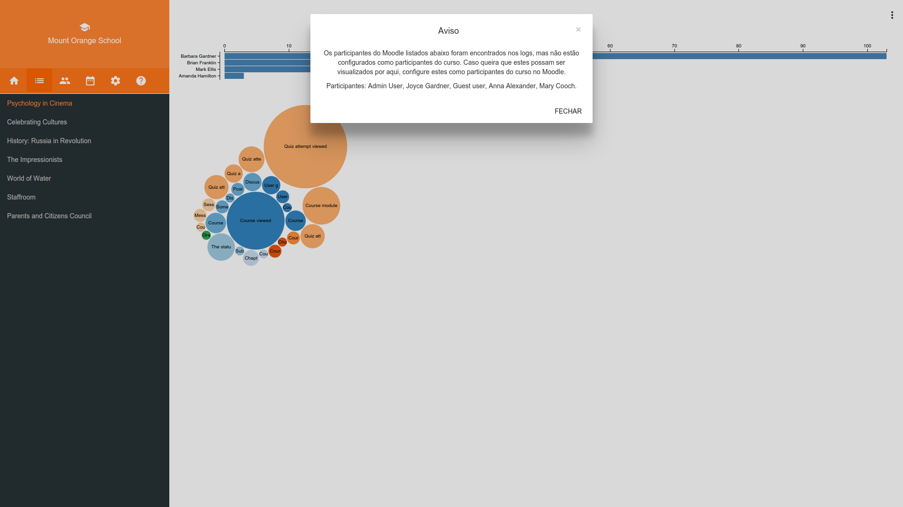
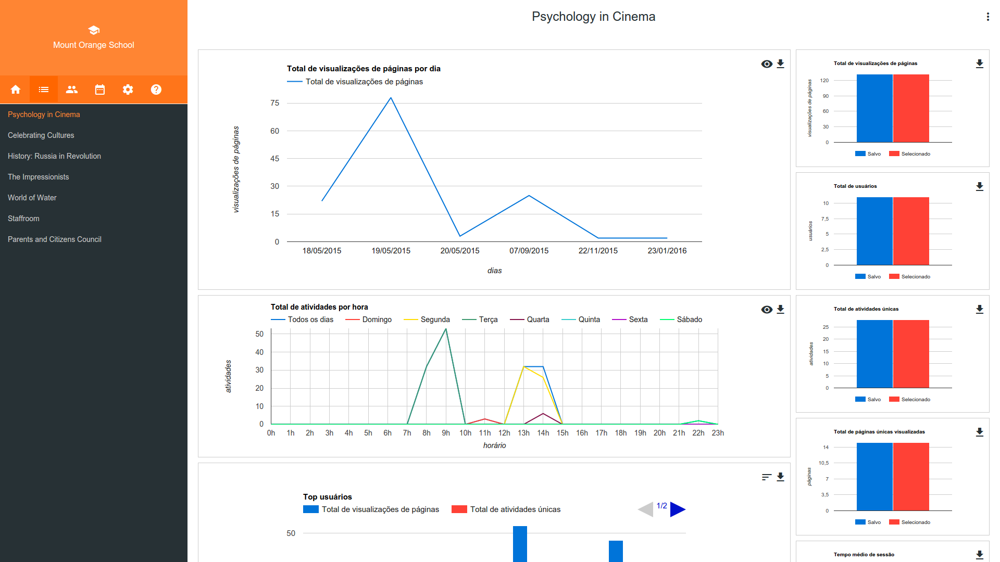

# Moodle dashboard

Plataforma: Extensão para Google Chrome | Chromium

[![Versão][version-image]][version-url] [![Licença MIT][license-image]][license-url]

## Documentação

### Moodle sem plugin

### Instalando o plugin

### Moodle com plugin - Mensagem de erro de sincronizaçao

### Moodle com plugin - Botão de acesso ao plugin

### Moodle dashboard - Nenhum Moodle sincronizado

### Moodle dashboard - Mensagem de usuários não encontrados na sincronização

### Moodle dashboard - Visão geral do curso

### Moodle dashboard - Visão geral do curso sem dados de logs sincronizados

### Moodle dashboard - Sincronizando dados de logs

### Moodle dashboard - Visão geral do curso com dados sincronizados

### Moodle dashboard - Seleção de Moodle (Início)

### Moodle dashboard - Usuários estudantes

### Moodle dashboard - Opções para filtrar usuários

### Moodle dashboard - Usuários professores

### Moodle dashboard - Seleção de usuários (Estudantes)

### Moodle dashboard - Seleção de período

### Moodle dashboard - Opções para seleção de período

### Moodle dashboard - Filtro para última semana

### Moodle dashboard - Configurações

### Moodle dashboard - Ajuda

### Moodle dashboard - Visualizações (em desenvolvimento)

## Próximas etapas de desenvolvimento

1. Visualização de dados (gráficos)
2. Opções de configurações
3. Guia de ajuda

[license-image]: http://img.shields.io/badge/license-MIT-blue.svg?style=flat
[license-url]: ../LICENSE

[version-image]: https://img.shields.io/badge/version-0.1-brightgreen.svg?style=flat
[version-url]: https://github.com/ldseinhardt/moodle-dashboard/releases
